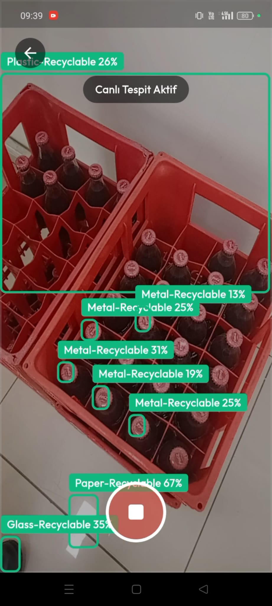
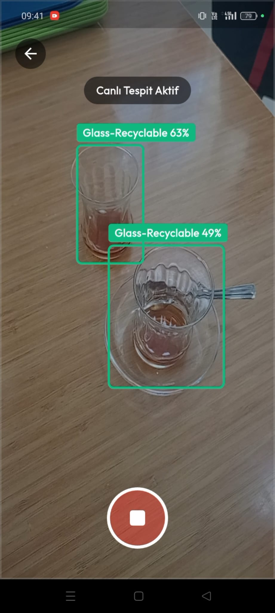
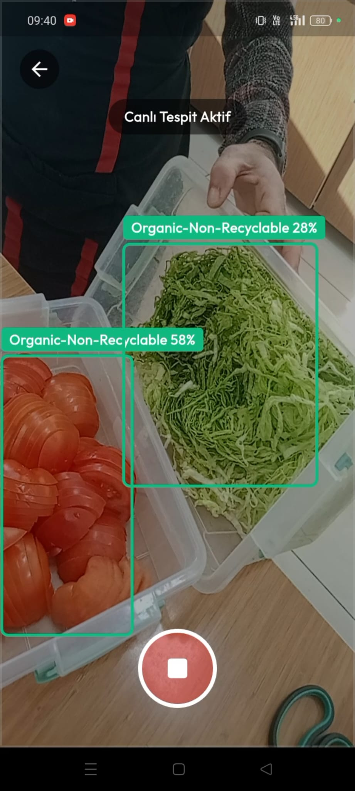

# 🧠 AI-Powered Waste Detection System

A real-time waste detection system built using YOLO-based deep learning models, integrated with a Flutter mobile application and a Python FastAPI backend.

---

## 🚀 Project Overview

This project is an end-to-end AI system designed to detect waste objects in real-time using computer vision.

The system consists of:

- 🐍 Python Backend (FastAPI)
- 🤖 YOLO Object Detection Model
- 📱 Flutter Mobile Application
- 🔗 REST API Communication

The mobile application captures images and sends them to the backend, where the trained YOLO model performs inference and returns detection results.

This project demonstrates full AI pipeline development including model integration, API design, and mobile deployment.

---

## 📸 Live Detection Results

<p align="center">
  
  
  
</p>

---

## 🏗️ System Architecture

Mobile App (Flutter)  
⬇  
REST API Request  
⬇  
FastAPI Backend  
⬇  
YOLO Model Inference  
⬇  
Detection Results Returned  

---

## 🛠️ Tech Stack

### Backend
- Python
- FastAPI
- YOLO
- OpenCV

### Mobile
- Flutter
- Dart

---

## 📂 Project Structure

```
ai-waste-detection-system/
│
├── backend/        # Python FastAPI + YOLO model
│   ├── main.py
│   └── requirements.txt
│
├── flutter_app/    # Flutter mobile application
│
└── README.md
```

---

## ⚙️ Installation & Setup

### 🔹 Backend Setup

```bash
cd backend
pip install -r requirements.txt
python main.py
```

The backend will start the FastAPI server and expose the detection endpoint.

---

### 🔹 Flutter App Setup

```bash
cd flutter_app
flutter pub get
flutter run
```

The mobile app will connect to the backend API and perform real-time waste detection.

---

## 🎯 Features

- Real-time object detection
- YOLO model inference via API
- Mobile camera integration
- Clean UI with Flutter
- End-to-end AI system architecture
- Backend–Mobile communication via REST API

---

## 📌 Future Improvements

- Model optimization for mobile/edge devices
- Cloud deployment (Docker / AWS / GCP)
- Performance benchmarking
- Multi-class detection expansion
- Authentication & user management

---

## 👩‍💻 Author

**Pınar Çelik**  
AI & Software Engineering Student  
GitHub: https://github.com/pince8